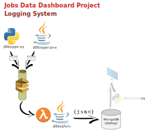

The logging structure will be as described:
- It will be used the [Python logging module][1];
- A message will be put in an AWS SQS FIFO queue with the [SQSHandler][2];
- A service in [AWS Lambda][3] will monitor this queue and process the messages;
- The log will be inserted in a collection in [MongoDB][4];
- A Python script will show the log with parameters (data range, origin, last N, level).

Log structure:

```json
{
    time: datetime
    origin: string identifying the system component that originated this message
    message: string
    level: string
}
```

Planned origins and respective INFO level messages:

* Origin: GrabberJob
- GrabberJob initiated.
- Grabbing data from <online job service name>.
- Notifying complete grab process for <online job service name> - NNN records retrieved.
- Message sent regarding data from <online job service name>.
- GrabberJob end.

* Origin: DataAnalyzer
- DataAnalyzer started - message received regarding data from <online job service name>.
- DataAnalyzer finished - Data from <online job service name> processed.



<!-- References: -->

[1]: https://docs.python.org/3/library/logging.html
[2]: https://github.com/zillow/python-sqs-logging-handler
[3]: https://aws.amazon.com/lambda/
[4]: https://www.mongodb.com/cloud/atlas
